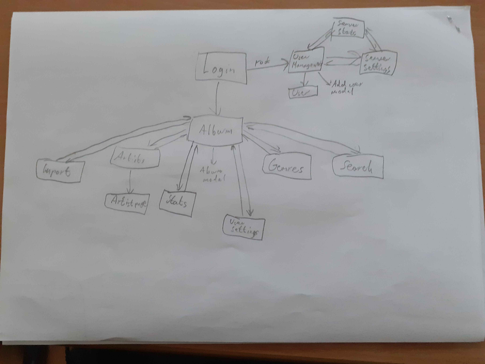
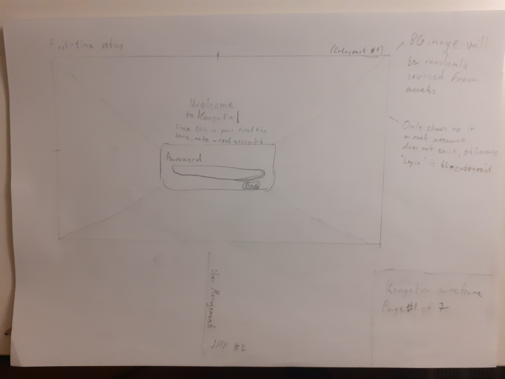
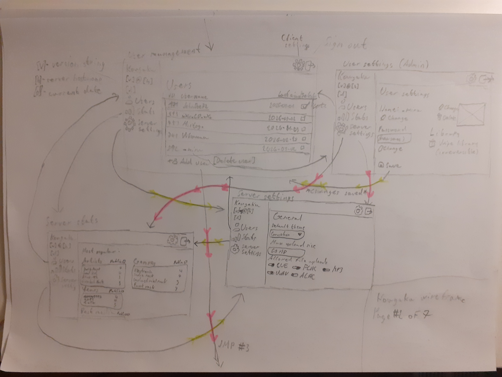
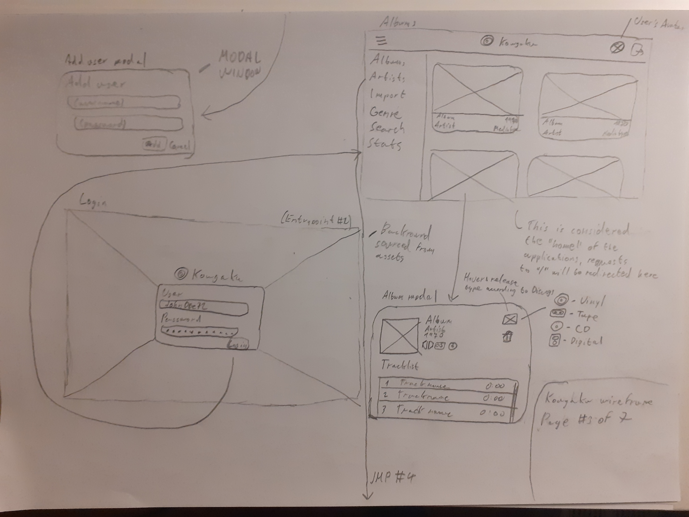
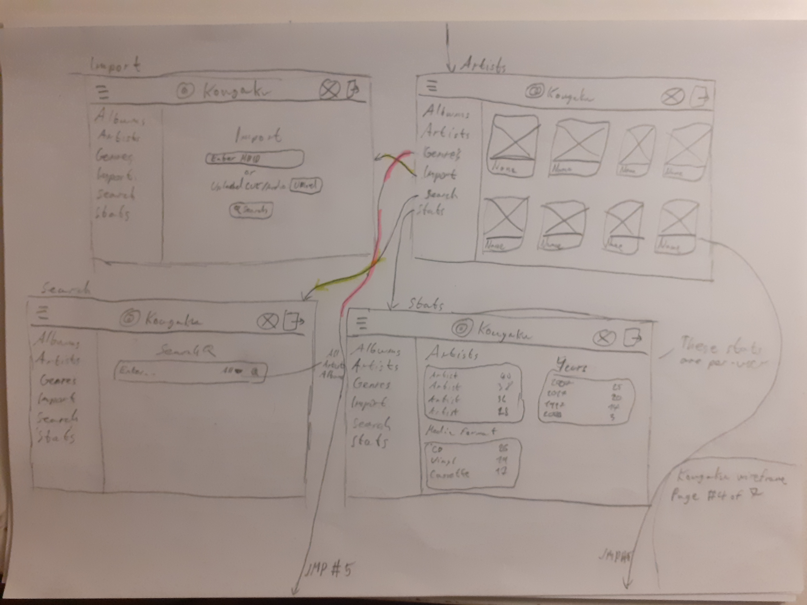
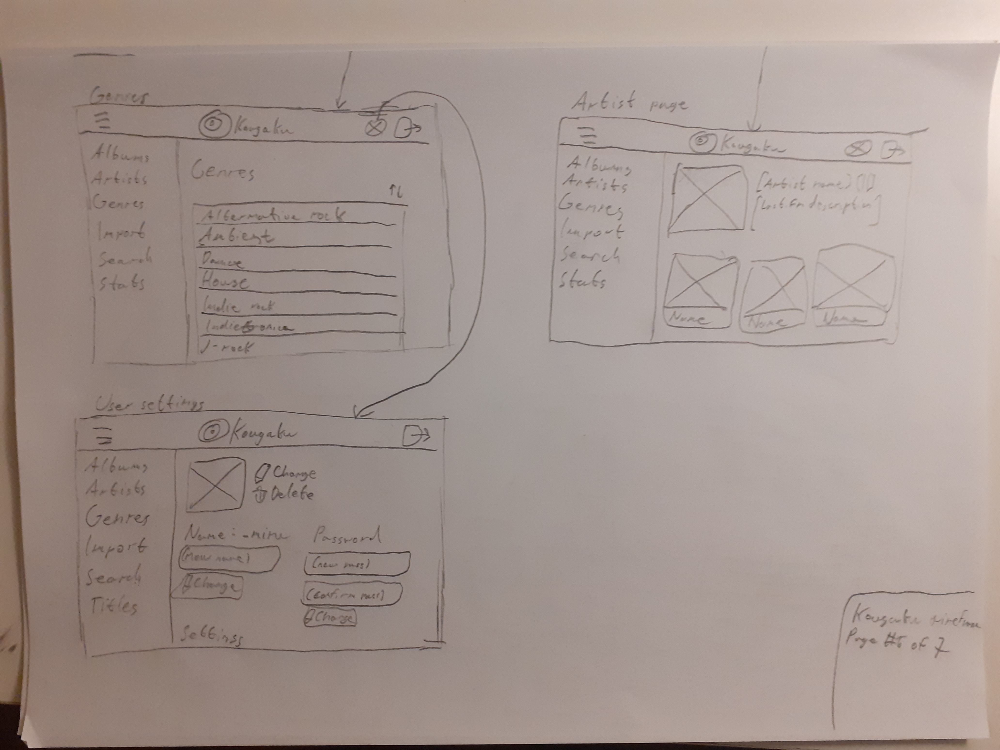
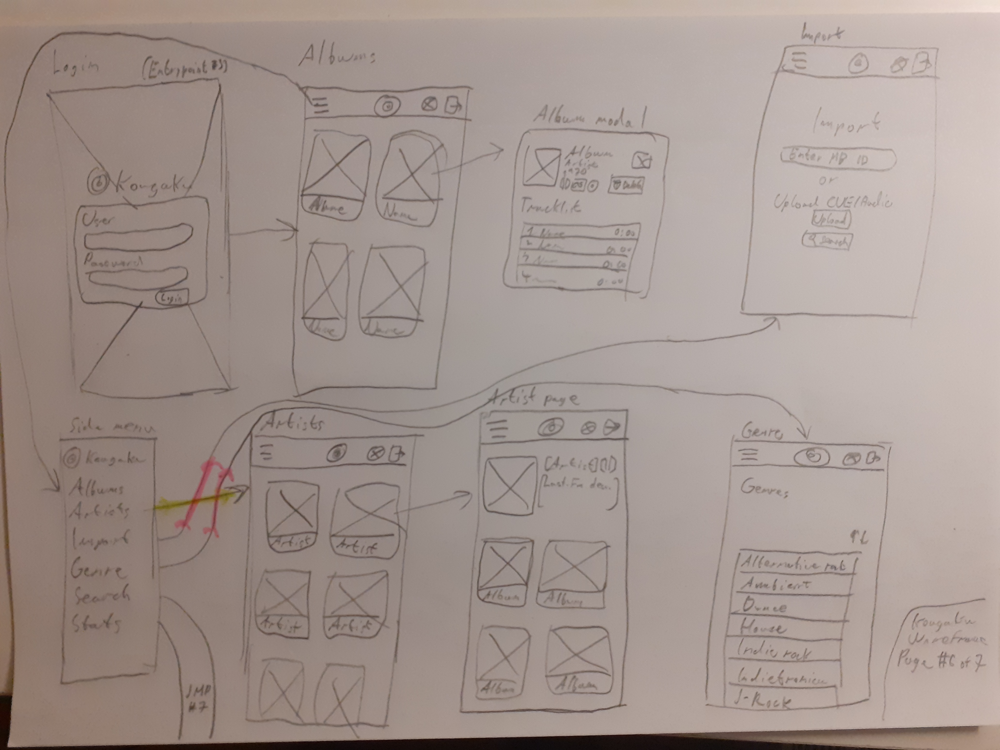
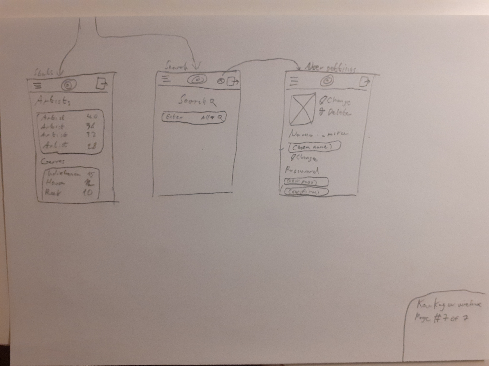

# Kougaku

> Význam jména - 光学 - *optika*

## Odborný článek

Kougaku je self-hosted webová aplikace pro indexování multimediálních knihoven. Její účel je jednoduché indexování, kategorizování a třízení fyzických médií do grafického prostředí. 

### Funkce

#### Knihovna
Položky jsou importované do knihovny podle vybrané formy médie (pomocí CUE souborů, WAV soubory na kterých proběhene audio fingerprinting, atd.), mezi podporované patří gramofonové desky, CD, kazety a digital downloads. Položky v knihovně mají u sebe veškerá metadata, včetně názvu alba, umělce, interpreta, listu tracků, atd., plus odkazy na [Musicbrainz](https://muzicbrainz.org) a [Discogs](https://discogs.com).

#### Statistiky
Každý uživatel je schopný nechat proběhnout analýzu na své knihovně, která prezentuje statistiky, jako nejposlouchanější žánr, nejoblíbenější umělci, aktuální finanční hodnota knihovny, atd.

#### Sdílení knihovny
Uživatel je schopen vygenerovat odkaz, pomocí kterého může nechat ostatní lidi nahlédnout do jejich knihovny. 

### Role

#### Nepřihlášený

Nepřihlášený uživatel nemá žádné privelegie na používání webové aplikace kromě zhlédnutí sdílecího odkazu vygenerovaný přihlášeným uživatelem a statistik označené administrátorem jako veřejné.

#### Uživatel

Uživatel si může vytvořit uživatele kontakováním administrátora instace. Uživatel je schopný přidávat do/upravovat/odstraňovat ze svojí knihovny. Taky má možnost upravovat osobní nastavení, která jsou ukládaná na bázi sessionu. (light/dark mode, scrobbling na [Last.FM](https://last.fm), atd.)

#### Administrátor

Administrátorský účet je jeden unikátní a je vytvářen při prvním spuštění instace. Je schopný přidávat/upravovat/odstraňovat uživatele a spravovat globální nastavení instace.

> [!CAUTION]
> V případě zapomenutí hesla administrátorského účtu je třeba **reinstalovat Kougaku**.

## User flow



## Wireframe

<details>
<summary>Desktopová část</summary>






</details>

<br>

<details>
<summary><b>Mobilní část</b></summary>



</details>

## Instalace

Kougaku je stavěný pro používání jako Docker container.

### Docker CLI

```bash
docker build -t kougaku .
docker run -p 8000:80 kougaku
```


### Docker Compose

<details>

<summary><b>docker-compose.yml (minimální)</b></summary>

```yml
services:
  kougaku:
    ports:
      - "8000:80"
    volumes:
      - "./data:/var/lib/kougaku"
```
</details>

<br>

<details>

<summary><b>docker-compose.yml (Traefik)</b></summary>

```yml
services:
  kougaku:
    volumes:
      - "./data:/var/lib/kougaku"
    networks:
      - traefik
    labels:
      - "traefik.enabled=true"
      - "traefik.http.routers.kougaku.rule=Host(`kougaku.example.com`)" # Change this to your domain
      # - "traefik.http.routers.kougaku.tls=true" # Uncomment if you have a TLS certificate set in your HTTP router
      - "traefik.http.routers.kougaku.tls.certresolver=default"
      - "traefik.http.services.kougaku.loadbalancer.server.port=80"

networks:
  traefik:
    external: true
```
</details>